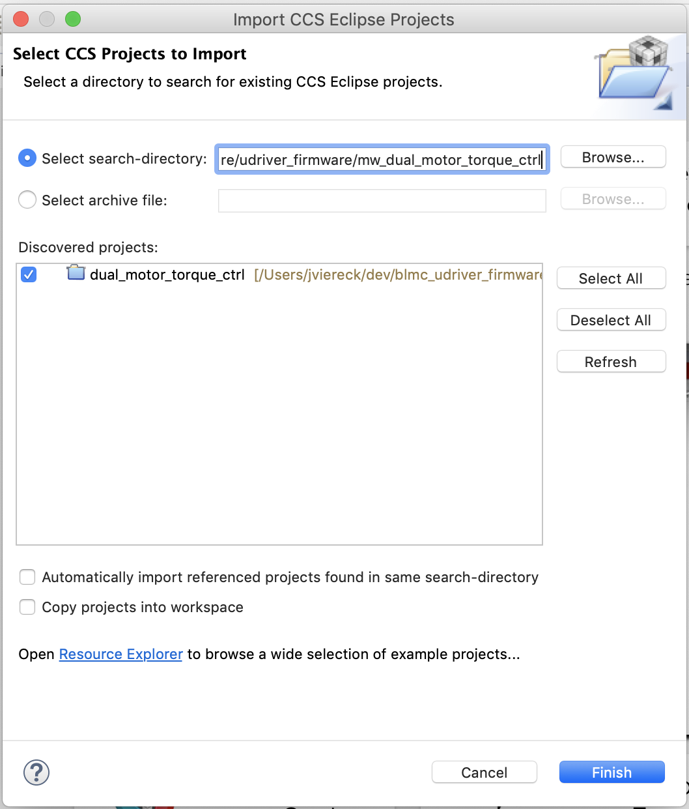
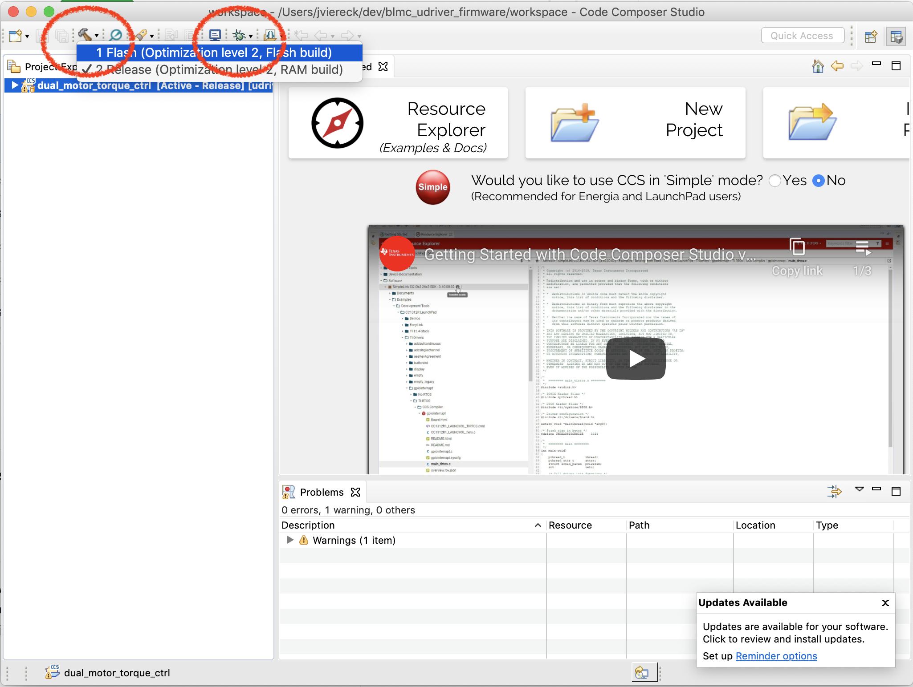

# udrive firmware

Firmware for running the udrive blmc boards together wtih the [master board](https://github.com/open-dynamic-robot-initiative/master-board/).

## MotorWare Patch

Our software is based on Texas Instruments' MotorWare library which is freely available on the TI website. We made some modifications to the original MotorWare which are needed to build our software. These changes are included in the file motorware_1_01_00_18_patch in this repository. Use the following steps to set up your workspace so you are able to build the software:

1. Download MotorWare v1.01.00.18 from the [TI website](http://www.ti.com/tool/MOTORWARE).

2. Install it to extract the source.  For Linux users: Unfortunately TI only
   provides a Windows installer.  There is not really an installation required,
   you only need the source files.  You can get them by either installing on a
   Windows machine or using an emulator like Wine on Linux and then copy the
   files from the installation directory.
   Search for the directory containing the `sw` directory and copy that into
   a directory called `motorware` in your workspace.  The structure should be
   like this:

       udriver_firmware
       ├── amd_motorware_ext
       ├── motorware
       │   ├── docs
       │   ├── eclipse
       │   ├── mw_explorer
       │   |── sw
       |   └── ...
       ├── mw_dual_motor_torque_ctrl
       ├── user_config_f28069m_drv8305
       └── ...

3. Now, from the `udriver_firmware/firmware` folder, patch the motorware directory

        patch -p1 < motorware_1_01_00_18.patch

## Installation / Board flashing

To flash the firmware on the udrive boards, follow these steps:

1. Download the latest version of [Ti CCStudio](http://www.ti.com/tool/ccstudio)
  * Follow the [install instructions](http://software-dl.ti.com/ccs/esd/documents/ccsv10_linux_host_support.html#installation-instructions)
    * **Note:** You can select 'custom installation' as recommanded, in this case you need to select the module `C2000 Realtime MCUs`
  * Make sure to install the drivers after installation, see [here](http://software-dl.ti.com/ccs/esd/documents/ccsv10_linux_host_support.html#ubuntu-18-04-lts).
    * **Note:** The path to the installation is by default in `ti/ccsXXX/ccs/` if the linstall is done without sudo. With sudo look in "/opt"
  * Restart your computer to ensure the drivers are working properly.
2. Clone / download this repo
3. Start CCStudio, create a new workspace
4. Import the projects in CCStudio via the menu: `Project > Import CCS Projects...`
  * Set the directory of the project you want to export as search-directory. For example `<path_to_udriver_firmare>/firmware/mw_dual_motor_torque_ctrl` for the torque controller. The Discovered projects pane should then show dual_motor_torque_ctrl.
  * Make sure the `Copy projects into workspace` option is **NOT** set.
  * 
5. Compile your code, using the "Flash" build. For this, click on the arrow next to the small hammer in the menu bar and select "Flash"
  * 
6. Make sure the udriver board is powered and connected via USB to the PC.
7. Start the Debugger by clicking on the bug icon in the tool bar. The view might change into the debug view.
8. If things go well, a progress window pops up (after up to 30 seconds). The window shows the progress of flashing the compiled firmware on the board. If no error message pops up, the flashing was successful.
9. The view is now in debug mode, you need to leave this mode before disconnected the udriver board. Click on the `stop` (red square) button located on the top of the interface.
10. Then you can power down the udriver board and disconnect the flasher.
